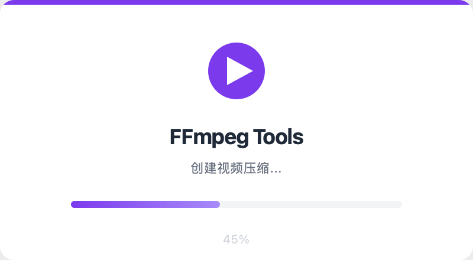
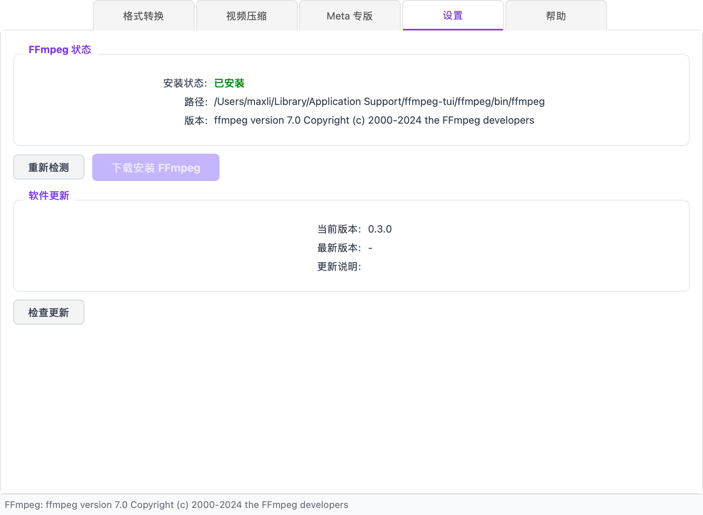
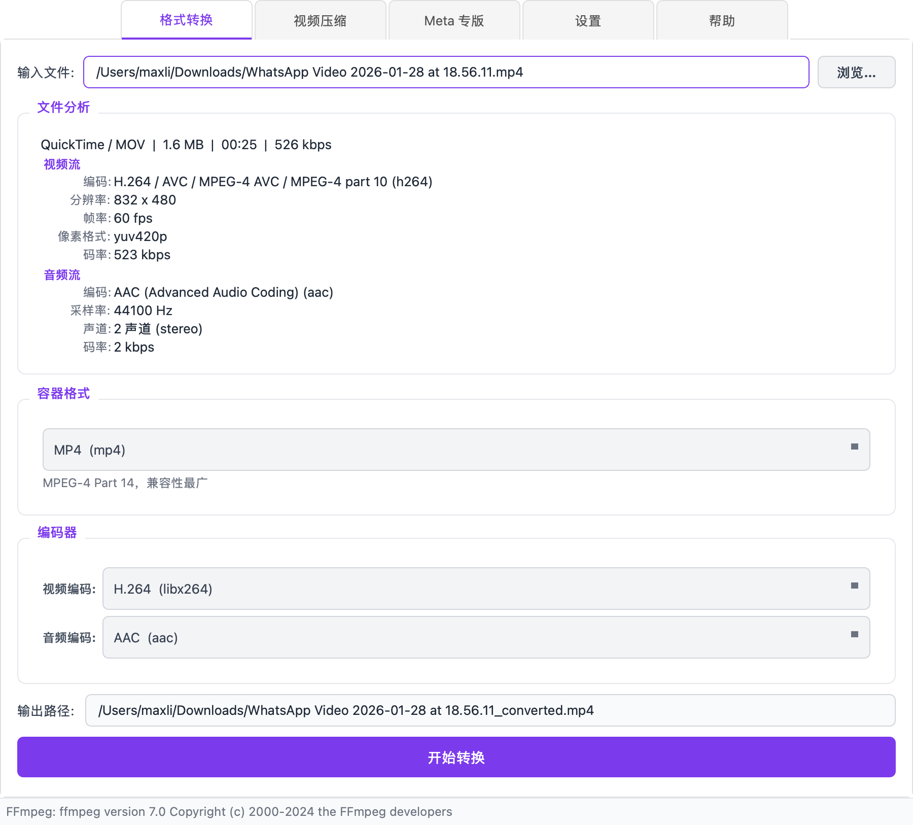
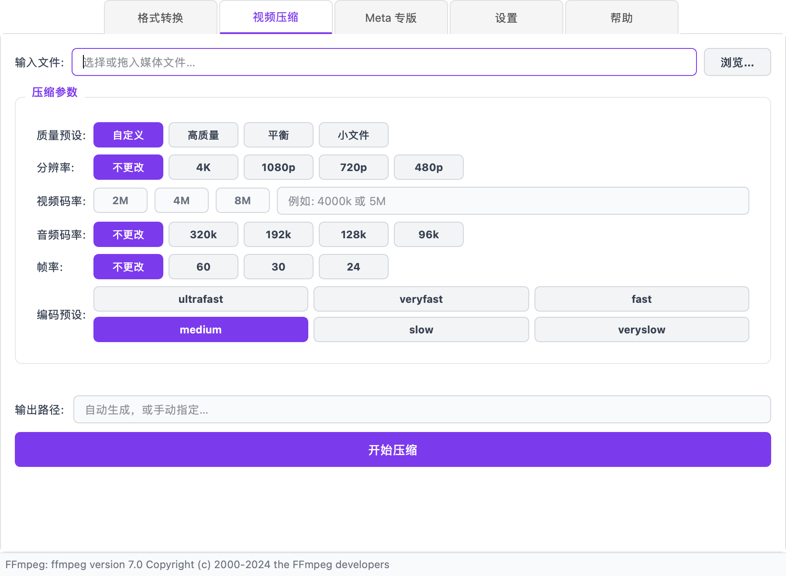
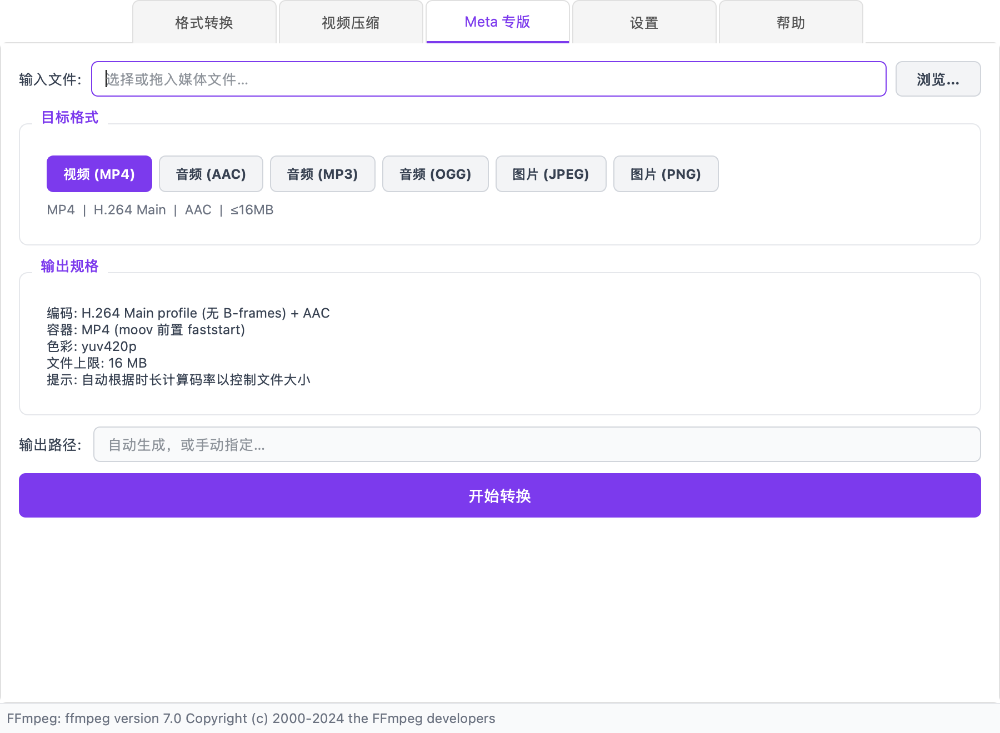
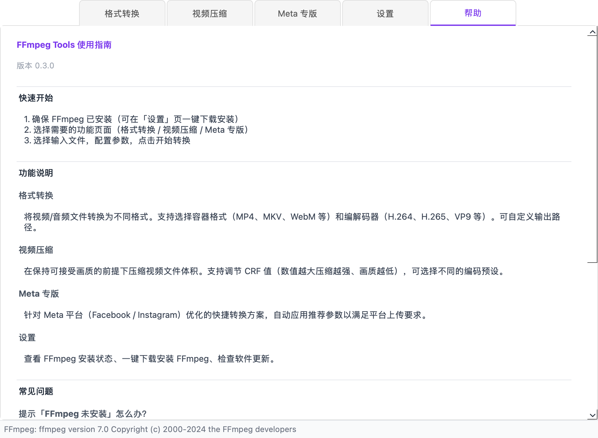

# FFmpeg Tools 使用指南

FFmpeg Tools 是一个简洁易用的 FFmpeg 图形界面工具，让视频/音频处理变得简单。

## 启动

启动应用后会显示加载进度，几秒后自动进入主界面。

---

## 功能总览

应用共有 5 个标签页，覆盖日常音视频处理的核心场景：

| 标签 | 用途 |
|------|------|
| 格式转换 | 视频/音频格式互转 |
| 视频压缩 | 压缩文件体积 |
| Meta 专版 | WhatsApp/Facebook/Instagram 优化 |
| 设置 | FFmpeg 安装与软件更新 |
| 帮助 | 内置使用说明 |

---

## 首次使用：安装 FFmpeg

FFmpeg 是本工具的核心依赖。如果你的系统还没有安装，打开「设置」页，点击 **下载安装 FFmpeg** 即可一键完成。

安装完成后，状态会显示「已安装」和具体版本号。如果你已通过 Homebrew 或其他方式安装了 FFmpeg，工具会自动检测到。

> 如果转换按钮显示为灰色，说明 FFmpeg 未安装或未被检测到，请前往设置页处理。

---

## 格式转换

将视频或音频文件转换为其他格式。

### 使用步骤

1. **选择输入文件** — 点击「浏览」或直接拖入文件
2. **查看文件分析** — 自动显示编码、分辨率、帧率、码率等详细信息
3. **选择输出格式** — 选择容器格式（MP4、MKV、WebM 等）和编解码器
4. **开始转换** — 输出路径会自动生成，也可手动修改

### 支持的格式

**容器格式**: MP4, MKV, WebM, AVI, MOV, FLV, TS, OGG, MP3, AAC, FLAC, WAV

**视频编码器**: H.264 (libx264), H.265 (libx265), VP9, AV1, 复制原始流

**音频编码器**: AAC, MP3 (LAME), Opus, Vorbis, FLAC, 复制原始流

---

## 视频压缩

在保持可接受画质的前提下压缩视频文件体积。

### 参数说明

| 参数 | 说明 |
|------|------|
| **质量预设** | 从「高质量」到「小文件」的快捷预设 |
| **分辨率** | 4K / 1080p / 720p / 480p 或保持原始 |
| **视频码率** | 控制视频质量和体积的关键参数 |
| **音频码率** | 通常 128k 即可满足大部分需求 |
| **帧率** | 可降低帧率进一步减小体积 |
| **编码预设** | ultrafast → veryslow，越慢压缩率越高 |

选择文件后会显示 **预估输出大小**，方便提前判断压缩效果。

---

## Meta 专版

针对 Meta 平台（WhatsApp / Facebook / Instagram）的媒体上传限制，自动应用推荐参数。

### 支持的目标格式

| 格式 | 规格 | 大小限制 |
|------|------|----------|
| 视频 (MP4) | H.264 Main + AAC, yuv420p | 16 MB |
| 音频 (AAC) | AAC 128kbps | 16 MB |
| 音频 (MP3) | MP3 LAME 128kbps | 16 MB |
| 音频 (OGG) | Opus 单声道 | 16 MB |
| 图片 (JPEG) | 8-bit RGB | 5 MB |
| 图片 (PNG) | 8-bit RGB/RGBA | 5 MB |

视频模式会自动根据时长计算合适的码率，确保输出文件不超过 16MB。

---

## 文件分析面板

选择任何媒体文件后，都会自动分析并显示详细信息：

- **容器格式** — QuickTime / MOV, MPEG-4 等
- **文件大小** 和 **时长**
- **总码率**
- **视频流** — 编码器、分辨率、帧率、像素格式、码率
- **音频流** — 编码器、采样率、声道数、码率

这些信息帮助你了解源文件的质量，做出合适的转换决策。

---

## 帮助页面

内置的帮助页面包含快速上手指南和常见问题解答，无需翻阅文档。

---

## 快捷键与技巧

- 支持 **拖拽文件** 到输入框，无需每次点击浏览
- 输出路径会 **自动生成**，但你随时可以手动修改
- 转换过程中可以点击 **取消按钮** 中止任务
- 状态栏会显示 FFmpeg 版本和新版本提醒

---

## 常见问题

**Q: 提示「FFmpeg 未安装」怎么办？**
前往「设置」页，点击「下载安装 FFmpeg」，程序会自动下载并配置。

**Q: 转换失败了怎么办？**
检查输入文件是否完整、输出路径是否有写入权限。部分格式组合可能不兼容（如将视频转为纯音频格式时，视频流会被丢弃，这是正常行为）。

**Q: 如何获取更小的文件？**
降低视频码率、分辨率或帧率。使用更慢的编码预设（如 slow/veryslow）也能在相同码率下获得更好的压缩率。

**Q: 支持批量转换吗？**
当前版本暂不支持，每次处理一个文件。
